


 

Full-stack developer with <b>5+ years</b> building production web applications — from pharmacy purchasing and accounting systems to SaaS platforms. 
📍 Pontevedra, Spain &nbsp;·&nbsp; 🇪🇺 EU citizen &nbsp;·&nbsp; 🌎 Open to remote roles worldwide

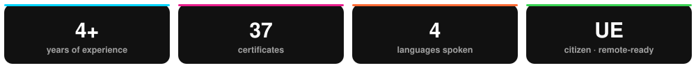

 

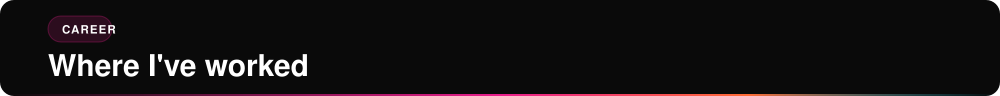

| Period | Role | Highlights |
| :-- | :-- | :-- |
| **Nov 2024 – Present** | **Full-Stack Developer · Freelance** Independent businesses | End-to-end delivery: requirements, UI/UX, frontend, backend integration, database and deployment. Shipped **PHOTU** (photography platform) and an **inventory & stock management** platform built on React, TypeScript, Tailwind, Material UI and Supabase. |
| **Aug 2022 – Oct 2024** | **Full-Stack Developer (Senior) · [Procfit (Cosmos Pro)](https://panoramafarmaceutico.com.br/automacao-de-compras-do-cosmos-pro/)** Brazil · team of 13 | React apps for accounting and pharmacy purchasing/sales · maintained and extended an **Angular SaaS** platform (metrics, interactive grids) · **Node.js REST APIs** for customer service and chat integrations incl. WhatsApp (OAuth + token auth) · **SQL Server** modelling and advanced queries · **Azure DevOps** release automation · mentoring junior developers. The Cosmos Pro purchasing-automation platform reached **R$ 4 billion in orders in 2024**. |
| **Oct 2021 – Jul 2022** | **Web Developer · UNIMES** Brazil | End-to-end institutional websites (academic info, schedules, enrolment, course content) with WordPress, Elementor, HTML, CSS and JavaScript. |

 

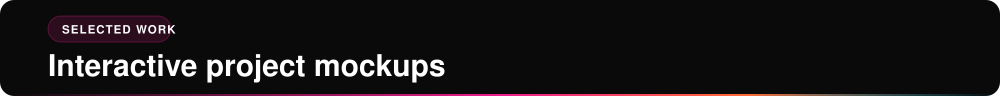

Click a card to open the interactive mockup, hosted on my portfolio. Mockups use sample data — no client code or data.

<table>
<tr>
<td width="50%"><a href="https://raphael-sanseverino.com/projects/sac.html">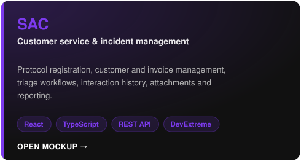</a></td>
<td width="50%"><a href="https://raphael-sanseverino.com/projects/plug-and-play.html">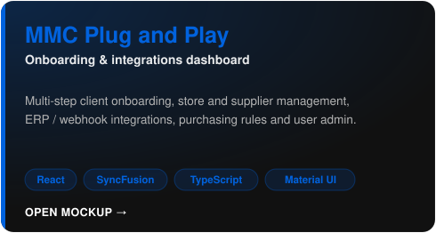</a></td>
</tr>
<tr>
<td width="50%"><a href="https://raphael-sanseverino.com/projects/tickets-atendentes.html">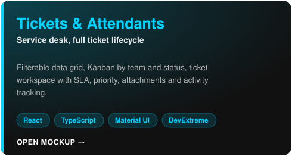</a></td>
<td width="50%"><a href="https://raphael-sanseverino.com/projects/Trade.html">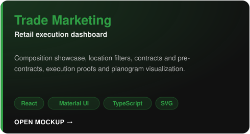</a></td>
</tr>
<tr>
<td width="50%"><a href="https://raphael-sanseverino.com/projects/estela-do-mar.html">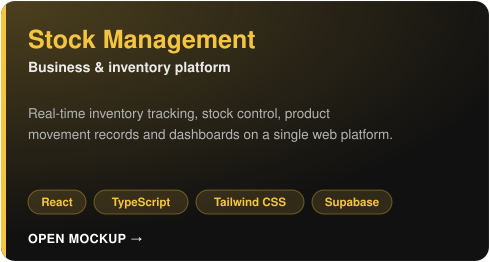</a></td>
<td width="50%"><a href="https://photu-one.vercel.app">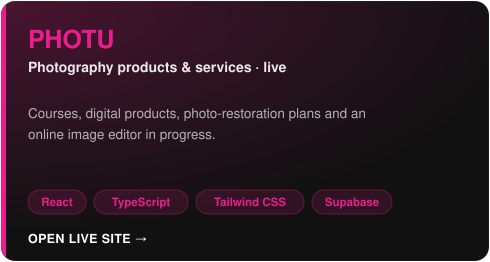</a></td>
</tr>
</table>

Source code: <a href="https://github.com/llr2ll/photu">PHOTU</a> &nbsp;·&nbsp; <a href="https://github.com/llr2ll/Portifolio-v2">this portfolio</a> (React + TypeScript, single page, 3 languages)

 

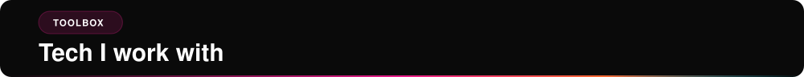

<table>
<tr><td width="130"><b>Frontend</b></td><td>

</td></tr>
<tr><td><b>Backend</b></td><td>

</td></tr>
<tr><td><b>Data</b></td><td>

</td></tr>
<tr><td><b>DevOps &amp; tools</b></td><td>

</td></tr>
<tr><td><b>Design</b></td><td>

</td></tr>
</table>

<b>How I work</b>

 

- **TypeScript-first, component-driven UIs** — reusable, responsive components over one-off screens.
- **Close to the product** — requirements to production, working alongside UX/UI designers and business teams.
- **Delivery discipline** — Git workflows, Azure DevOps pipelines, Scrum / Kanban, ad-hoc support for junior developers.
- **Languages** — 🇧🇷 Portuguese (native) · 🇬🇧 English (advanced) · 🇪🇸 Spanish (intermediate) · Galician (intermediate).

 

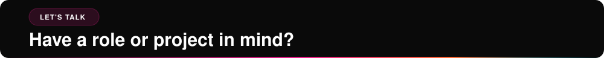

Let's turn ideas into concrete, efficient and profitable solutions.

  

<i>Building products, not just interfaces.</i>

